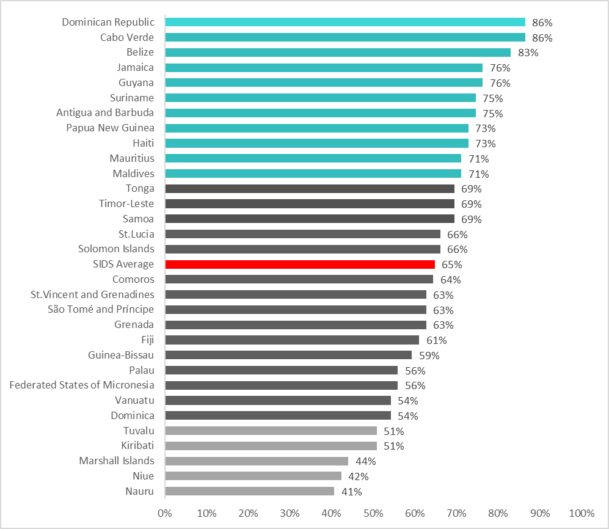
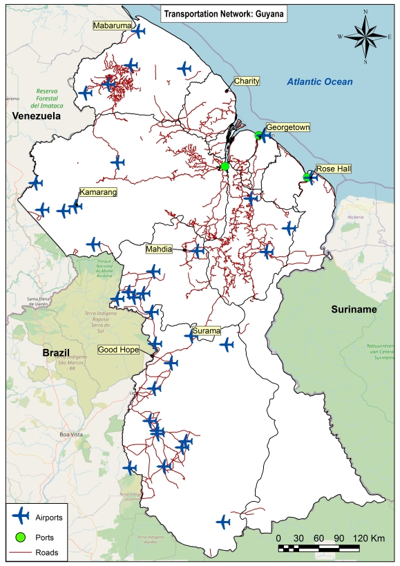
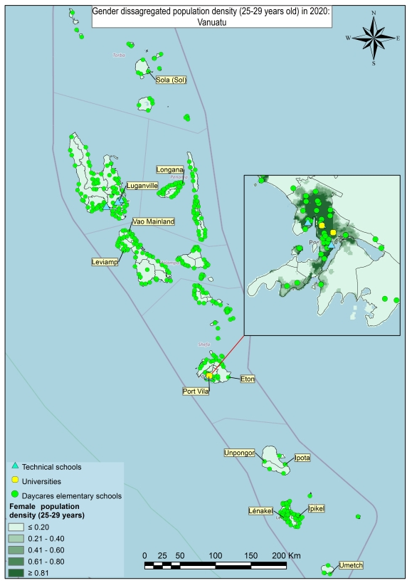
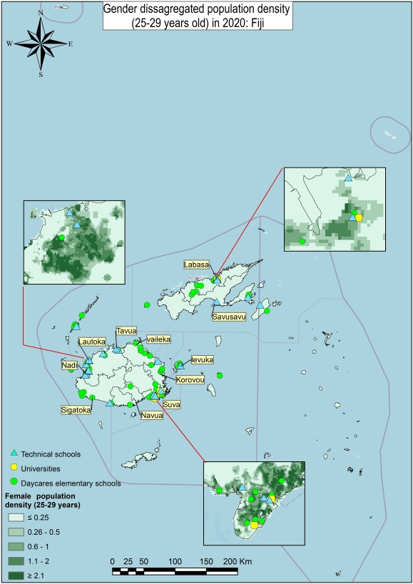

# Geospatial Assessment of Women Employment and Business Opportunities in the Renewable Energy Sector

With support from the [Canada Clean Energy and Forest Climate Facility (CCEFCFy)](https://www.worldbank.org/en/topic/climatechange/brief/canada-world-bank-clean-energy-and-forests-climate-facility), the [Geospatial Operational Support Team (GOST, DECSC)](https://worldbank.github.io/GOST) launched the project "Geospatial Assessment of Women Employment and Business Opportunities in the Renewable Energy Sector." The project aims to propose a novel methodology and generate a geospatial open-source tool for mapping the enabling environments for women in a country that can inform new energy projects to support the advancement of women's economic empowerment in SIDS while contributing to closing gender gaps in employment in the RE sector.


<p align="center">
  
</p>

Countries included in the project:

<font size="2">

| AFRICA | LATIN AMERICA AND CARIBBEAN | EAST ASIA AND PACIFIC | SOUTH ASIA |
| --- | --- | --- | --- |
| Cabo Verde | Antigua and Barbuda | Federated States of Micronesia | Maldives |
| Comoros | Belize | Fiji  | |
| Guinea-Bissau | Dominica | Kiribati | |
| Mauritius | Dominican Republic | Marshall Islands | |
| São Tomé and Príncipe | Grenada | Nauru | |  
| | Guyana | Niue | |  
| | Haiti | Palau | |  
| | Jamaica | Papua New Guinea | |  
| | St. Lucia | Samoa | |  
| | St. Vincent and Grenadines | Solomon Islands | |
| | Suriname | Timor-Leste | |  
| | | Tonga | |  
| | | Tuvalu | |  
| | | Vanuatu | |
  
</font>

**Project Components**

The project is divided into six main components:

  1. [Gender Spatial Data Gap Assessment](gender-spatial-data-gap-assessment)
  2. [Geospatial Databases](geospatial-databases)
  3. [Novel Analytical Framework](novel-analytical-framework)
  4. [Gender Enabling Environments Tool (GEEST)](gender-enabling-environments-tool-geest)
  5. [Implementation](implementation)
  6. [GEEST Main Limitations](geest-main-limitations)

(gender-spatial-data-gap-assessment)=

## 1. Gender Spatial Data Gap Assessment

This undertaking involved the identification and compilation of essential open-source geospatial information layers that are crucial for assessing women's development, employment, and business prospects within the Renewable Energy (RE) sector. A thorough research was conducted for 59 data layers within each country, organized into 12 thematic categories. The table below presents the 59 layers identified during the desk research,  grouped into 12 categories, as outlined below

<br>

This effort resulted in a Data Gap Analysis Report for each of the 31 SIDS included in the project. The report for each country provides a comprehensive overview of the findings derived from an extensive data gap analysis, specifically centered on women in SIDS and their access (or lack thereof) to employment opportunities within the RE sector. This endeavor entailed thorough desk-based research, necessitating a detailed exploration of both spatial and non-spatial data sources that are publicly available. The focus was on identifying critical open sources, evaluating the resolution and quality of the data, and specifying any pertinent gaps or missing information in each country. The reports are available here: <https://datacatalog.worldbank.org/search/collections/genderspatial>

<font size="2">

| **Reference Data** |
| --- |
| Administrative boundaries |
| Location and outline of cities/villages |
| Coordinate reference system |  
| **Demographics and Population** |
| Population Density |  
| Level of Education |  
| Age |   
| Workplace Discrimination |
| Regulatory Frameworks |  
| Financial Inclusion |
| **Renewable Energy** |
| Existing RE: Solar Plants |
| Potential RE Project Sites: Solar |
| Potential RE Project Sites: Wind |
| Potential RE Project Sites: Wind Offshore |
| **Energy Access** |
| Measure of Visible Light at Nighttime |
| **Education** |
| Location of Universities |  
| Location of Technical Schools |  
| Percentage of Women who have achieved a post-secondary education | 
| **Jobs and Finance** |
| Financial Facilities |
| Labor in Industry Sector, Gender-Disaggregated | 
| **Digital Inclusion** |
| Access to Broadband Rates |  
| Digital Literacy Rates |  
| **Transportation** |
| Public Transportation Networks |  
| Public Transportation Stops |  
| Ports |
| Airports |
| Mobility Dataset |
| Commuting Zones |
| **Safety** |
| Prevalence of Domestic Violence |
| Trust in the Police |  
| Street lights for safe areas at night |  
| **Amenities** |
| Location of Hospitals |  
| Location of Grocery Stores |  
| Location of Green Spaces |  
| Location of Daycares/Elementary Schools | 
| Location of Pharmacies |  
| **Climate/Earth (5 datasets, four in GDB)** |
| Fires |  
| Coastal or Inland Flood Risk |  
| Cyclones |
| Landslides |
| Drought |
| **Law/Policy/Government** |
| Missing Data from SDGs |

</font>

The following figure summarizes the data availability concerning the 59 datasets examined for each country:

:::{figure-md} markdown-fig


Proportion of data availability for the 59 datasets, by country
:::

(geospatial-databases)=

## 2. Geospatial Databases

In parallel with the Gender Data Gap Assessment, a comprehensive geospatial database was compiled for each of the 31 Small Island Developing States (SIDS) Targeted in the project.  The repository containing the geospatial databases can be found in the following link: <https://datacatalog.worldbank.org/search/collections/genderspatial>

Examples of data layers present in the GDB for selected countries:








## 3. Novel Analytical Framework

An extensive literature review, focusing on the barriers women face in securing jobs, particularly within SIDS, was conducted. This comprehensive review resulted in the formulation of a Multicriteria Evaluation (MCE) framework comprising 15 key factors, both spatial and non-spatial, that affect women’s job opportunities, categorized into three dimensions: Contextual, Accessibility, and Place Characterization. The latter two dimensions concentrate on geographical factors. For a comprehensive understanding of the Analytical Framework and the associated methodology employed to evaluate women's spatial access to employment opportunities, please refer to the Methodology Report available at the following link: <https://documents.worldbank.org/en/publication/documents-reports/documentdetail/099121123091527675/p1792120dc820d04409928040a279022b42>

<p align="center">
  
</p>

(gender-enabling-environments-tool-geest)=

## 4. Gender Enabling Environments Tool (GEEST)

Based on the Methodological Framework, the GEEST, an open-source plugin in QGIS, was developed for the automatic computation of the factors and dimensions. The GEEST characterizes communities based on women's prospects to secure jobs or establish their own businesses within the RE sector. It aims to assist decision-makers in selecting optimal locations for RE projects, ensuring the maximum positive impact on communities and addressing gender disparities. Additionally, it provides insights for building the necessary infrastructure around RE projects to create enabling environments that enhance women's participation in the RE sector in SIDS.

The table below outlines the dimensions, factors, and recommended indicators for computing the GEEST, derived from the Methodological Framework:


<p align="center">
  
</p>

Dimensions, Factors and indicators included in the Analytical Framework
:::

The GEEST generates raw score outputs for 15 factors outlined in the Analytical Framework. Each of the 15 factors, dimensions, and overall aggregate scores are assessed on a scale ranging from 0 to 5.

The interpretation of these scores is thoroughly detailed in the Methodology Report: <https://documents.worldbank.org/en/publication/documents-reports/documentdetail/099121123091527675/p1792120dc820d04409928040a279022b42>. 

Higher scores signify a more conducive environment for women to access job opportunities. Conversely, scores of 0 indicate a lack of supportive conditions for women to access employment opportunities. To enhance comprehension, the methodology further categorizes these scores into distinct 'classes,' offering a simplified approach to their interpretation, as shown in the following table:

```{list-table} Proposed discrete score classes to enable simpler visual interpretation of raw score outputs and enable intersection with other layers of information (reproduced from the Methodology Report).
:header-rows: 1
:name: Class Scores Table

* - Score range
  - Class
  - Interpretation
* - 0.00-0.50
  - 0
  - Not enabling
* - 0.51-1.50
  - 1
  - Very low enabling
* - 1.51-2.50
  - 2
  - Low enabling
* - 2.51-3.50
   - 3
   - Moderately enabling
* - 3.51-4.50
   - 4
   - Enabling
* - 4.51-5.00
   - 5
   - Highly enabling
```

To access the User Manual for GEEST and the necessary installation files for QGIS, please visit the [User Guide](docs/user_guide.md) or the [GitHub repository](https://github.com/worldbank/GEEST).

(implementation)=
## 5. Implementation

The GEEST was tested Saint Lucia to assess its functionality. The selection of this country was strategic, considering its varied geographic region, size, population densities, and data availability. Testing the GEEST across such a broad range of conditions ensured that its usefulness, applicability, and functionality in different contexts could be accurately tested. The findings and insights derived from the GEEST implementation are documented in the Implementation Report, accessible through the following link: [insert link].

#### CONTEXTUAL DIMENSION IN SAINT LUCIA

The Contextual dimension encompasses factors that provide information concerning the laws and policies in place, influencing workplace gender discrimination, financial autonomy, and overall gender empowerment.

<p align="center">
  
</p>

#### ACCESIBILITY DIMENSION RESULTS IN SAINT LUCIA

The Accessibility dimension includes factors that relate to the ease with which women can reach specific services or destinations and are often determined by proximity. These factors affect the day- to-day mobility of women. Accessibility factors found to be most relevant to women in SIDS include  (i) women's travel patterns, (ii) access to public transport, (iii) access to education facilities, (iv) access to health facilities, (v) access to financial facilities.


<p align="center">
  
</p>

<p align="center"><strong>Accessibility factors</strong></p>


<p align="center">
  
</p>

<p align="center"><strong>Accessibility factors aggregated</strong></p>


#### PLACE CHARACTERIZATION DIMENSION RESULTS IN SAINT LUCIA

The Place-Characterization dimension contains factors that refer to attributes that are used to define a specific geographical location or environment and do not include a mobility component. Those deemed to be most important place-characterization factors concerning women’s access to jobs include (i) walkability, (ii) safety, (iii) digital inclusion, (iv) environmental hazards, (v) education , (vi) fragility, conflict, and violence, and (vii) water sanitation.

<p align="center">
  
</p>

<p align="center"><strong>Place characterization factors</strong></p>

<p align="center">
  
</p>

<p align="center"><strong>Place characterization factors aggregated</strong></p>

Below are some of the overall insights derived from the GEEST for Saint Lucia. The first map illustrates the degree of enablement within environments; the second map shows the level of enablement concerning the female population on a raster 100x100m format. The third map shows the results for the level of enablement concerning female population, aggregated at the administrative subdivisions of the island.


<p align="center">
  
</p>

Raster results concerning enabling environments for Saint Lucia
:::


<p align="center">
  
</p>

Raster results concerning enabling environments with respect to women’s population for Saint Lucia
:::


<p align="center">
  
</p>

Aggregate results concerning enabling environments with respect to women’s population for Saint Lucia at administrative subdivision level
:::

If the job opportunities' location layer is presented in raster format, the GEEST can generate scores specifically for the regions where employment prospects exist, emphasizing opportunities exclusively within those areas.


<p align="center">
  
</p>

Raster results concerning enabling environments in RE sites with respect to women’s population for Saint Lucia
:::

(geest-main-limitations)=

## 6. GEEST Main Limitations

#### Data Availability and Granularity

The effectiveness of GEEST relies heavily on the quality of open-source data. Therefore, it is imperative to underscore that the principal limitation of the tool in its current state originates from the scarcity of open-source data in SIDS and the limited granularity of the available data. One of the primary challenges in data collection for St. Lucia was the prevalence of information in non-geospatial formats, such as PDFs and JPGs, or as simple statistics found in sources like the World Bank’s Data Portal. Specifically, the Central Statistical Office of St. Lucia’s Mapping Unit distributes maps exclusively in PDF format. Additionally, at the time of our research, the 2022 Census data had not yet been released, leaving us with only the 2010 Census data, which may not accurately reflect the current situation of the country. Furthermore, this earlier census data was largely unavailable in a geospatial format. Moreover, as mentioned earlier, information sourced from open-source repositories (like OSM) was occasionally outdated, incomplete, or lacked detailed specifications regarding the attributes of mapped features, a notable example being financial facilities. 

#### Processing Time

The processing of factors within the Place Characterization dimension is notably slow. Subsequent enhancements should prioritize the reduction of computational demands for calculating these indicators.

#### Methodological Deviations

The Place Characterization factors pose challenges due to restricted data availability, necessitating deviations from the proposed geoprocessing techniques outlined in the methodology. The granularity of GEEST's output is confined by available data, suggesting potential refinement opportunities in geoprocessing procedures with improved data access or alternative methods to those specified in the methodology.

#### Opportunities for Enhancement

To improve the quality and availability of data for GEEST input in Saint Lucia, the following enhanced strategies are recommended:

**Invest in Proprietary Gender Data**: Secure proprietary datasets that shed light on domestic violence, Gender-Based Violence (GBV), and women's safety perceptions. Collaborate with organizations specializing in gender-sensitive issues, as they likely possess valuable data.

**Leverage Satellite Imagery and Drone Technology**: Use satellite imagery and aerial photography to assess the comprehensiveness and quality of the geospatial datasets included in this analysis. Specifically, around the areas where potential or current job opportunities are located, to verify the accuracy of the results.

**Adopt Mobile Data Collection Techniques**: Considering Saint Lucia's size, the strategic use of mobile applications, such as KoboToolbox, for field data collection can be highly efficient, requiring minimal personnel. These tools empower field workers to collect, update, and immediately share geospatial data, significantly enhancing data accuracy and timeliness.

**Host Mapathons**: Organize mapathons to mobilize volunteers for the mapping of current geospatial data or to perform quality assurance checks. This method is invaluable for refreshing outdated maps in neglected areas, thus achieving more extensive and accurate mapping.

**Establish Standardized Data Protocols**: Ensure the adoption of standardized protocols for geospatial data collection and management. Uniform standards are key to preserving data consistency and ensuring that different datasets and projects are compatible, thereby boosting data integration and application effectiveness.

By implementing these refined strategies, the accessibility and quality of data for GEEST inputs in Saint Lucia can be significantly enhanced, leading to more informed analyses and decision-making processes.

### Citation
World Bank. A Methodological Framework for the Geospatial Assessment of Women Employment and Business Opportunities in the Renewable Energy Sector: Methodology Report (English). Washington, D.C. World Bank Group. http://documents.worldbank.org/curated/en/099121123091527675/P1792121dc820d04419928140a279022b42
