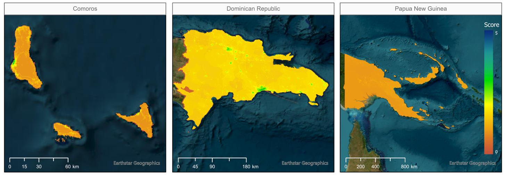

# Geospatial Assessment of Women Employment and Business Opportunities in the Renewable Energy Sector

With support from the [Canada Clean Energy and Forest Climate Facility (CCEFCFy)](https://www.worldbank.org/en/topic/climatechange/brief/canada-world-bank-clean-energy-and-forests-climate-facility), the [Geospatial Operational Support Team (GOST, DECSC)](https://worldbank.github.io/GOST) launched the project "Geospatial Assessment of Women Employment and Business Opportunities in the Renewable Energy Sector." The project aims to propose a novel methodology and generate a geospatial open-source tool for mapping the enabling environments for women in a country that can inform new energy projects to support the advancement of women's economic empowerment in SIDS while contributing to closing gender gaps in employment in the RE sector.




Countries included in the project:

<font size="2">

| AFRICA | LATIN AMERICA AND CARIBBEAN | EAST ASIA AND PACIFIC | SOUTH ASIA |
| --- | --- | --- | --- |
| Cabo Verde | Antigua and Barbuda | Federated States of Micronesia | Maldives |
| Comoros | Belize | Fiji  | |
| Guinea-Bissau | Dominica | Kiribati | |
| Mauritius | Dominican Republic | Marshall Islands | |
| São Tomé and Príncipe | Grenada | Nauru | |  
| | Guyana | Niue | |  
| | Haiti | Palau | |  
| | Jamaica | Papua New Guinea | |  
| | St. Lucia | Samoa | |  
| | St. Vincent and Grenadines | Solomon Islands | |
| | Suriname | Timor-Leste | |  
| | | Tonga | |  
| | | Tuvalu | |  
| | | Vanuatu | |
  
</font>

**Project Components**

The project is divided into six main components:

  1. [Gender Spatial Data Gap Assessment](gender-spatial-data-gap-assessment)
  2. [Geospatial Databases](geospatial-databases)
  3. [Novel Analytical Framework](novel-analytical-framework)
  4. [Gender Enabling Environments Tool (GEEST)](gender-enabling-environments-tool-geest)
  5. [Implementation](implementation)
  6. [GEEST Main Limitations](geest-main-limitations)

(gender-spatial-data-gap-assessment)=

## 1. Gender Spatial Data Gap Assessment

This undertaking involved the identification and compilation of essential open-source geospatial information layers that are crucial for assessing women's development, employment, and business prospects within the Renewable Energy (RE) sector. A thorough research was conducted for 59 data layers within each country, organized into 12 thematic categories. The table below presents the 59 layers identified during the desk research,  grouped into 12 categories, as outlined below

<br>

This effort resulted in a Data Gap Analysis Report for each of the 31 SIDS included in the project. The report for each country provides a comprehensive overview of the findings derived from an extensive data gap analysis, specifically centered on women in SIDS and their access (or lack thereof) to employment opportunities within the RE sector. This endeavor entailed thorough desk-based research, necessitating a detailed exploration of both spatial and non-spatial data sources that are publicly available. The focus was on identifying critical open sources, evaluating the resolution and quality of the data, and specifying any pertinent gaps or missing information in each country. The reports are available here: <https://datacatalog.worldbank.org/search/collections/genderspatial>

<font size="2">

| **Reference Data** |
| --- |
| Administrative boundaries |
| Location and outline of cities/villages |
| Building footprints |  
| **Demographics and Population** |
| Population Density |  
| Level of Education |  
| Age |
| Wealth Index |
| Female-Headed Households |  
| Average Number of Children |  
| Adolescent Fertility Rate |  
| Share of Female University Graduates, STEM |
| Tertiary -Post Secondary- Education Attainment |  
| Secondary Education Attainment |
| Agency of Women: Sexual Relations, Contraception, Reproductive Care |  
| **Renewable Energy** |
| Existing RE: Solar Plants |
| Potential RE Project Sites: Solar |
| Potential RE Project Sites: Wind |
| Potential RE Project Sites: Wind Offshore |
| **Energy Access** |
| Location of Power Plants |  
| Location of Stations and Substations |  
| Grid Network: Transmission + Distribution |  
| Prevalence of Energy Source |
| Measure of Visible Light at Nighttime |  
| Electrification Rates |  
| Access to Electricity/Community |  
| Access to Reliable Electricity/Community |  
| **Education** |
| Location Universities |  
| Location Technical Schools |  
| **Jobs and Finance** |
| Financial Facilities |
| Labor in Industry Sector, Gender-Disaggregated |  
| % Female Managers/Entrepreneurship |
| % Women in Middle/High Management Positions |
| Economic Participation and Opportunities Gap Score |
| Unpaid Domestic Work (% of day) |
| **Digital Inclusion** |
| Access to Broadband Rates |  
| Digital Literacy Rates |  
| **Transportation** |
| Road Network |
| Public Transportation Networks |  
| Public Transportation Stops |  
| Ports |
| Airports |
| Mobility Dataset |
| Commuting Zones |
| **Safety** |
| Crime Incidence: Serious Assaults |
| Crime Incidence: Sexual Violence |
| Prevalence of Domestic Violence |
| Trust in the Police |  
| **Amenities** |
| Location of Hospitals |  
| Location of Grocery Stores |  
| Location of Playgrounds and Parks |  
| Location of Daycares/Elementary Schools |  
| **Climate/Earth (5 datasets, four in GDB)** |
| Average Rainfall |  
| Coastal Flood Risk |  
| Vegetation Areas |
| Waterways |
| **Law/Policy/Government** |
| Sexual and Reproductive Health and Rights (% developed) |
| Length of Paid Maternity Leave (days) |
| Legislation Against Domestic Violence |
| Non-Discrimination Employment Legislation: Gender-Based |
| Legislation Against Sexual Harassment in Employment |  
| National Parliament Seats Held by Women (%) |
| Missing Data from SDGs |

</font>

The following figure summarizes the data availability concerning the 59 datasets examined for each country:

:::{figure-md} markdown-fig


Proportion of data availability for the 59 datasets, by country
:::

(geospatial-databases)=

## 2. Geospatial Databases

In parallel with the Gender Data Gap Assessment, a comprehensive geospatial database was compiled for each of the 31 Small Island Developing States (SIDS) Targeted in the project.  The repository containing the geospatial databases can be found in the following link: <https://datacatalog.worldbank.org/search/collections/genderspatial>

Examples of data layers present in the GDB for select countries:


(novel-analytical-framework)=

## 3. Novel Analytical Framework

An extensive literature review, focusing on the barriers women face in securing jobs, particularly within SIDS, was conducted. This comprehensive review resulted in the formulation of a Multicriteria Evaluation (MCE) framework comprising 23 key factors, both spatial and non-spatial, that affect women’s job opportunities, categorized into four dimensions: Individual, Contextual, Accessibility, and Place Characterization. The latter two dimensions concentrate on geographical factors. For a comprehensive understanding of the Analytical Framework and the associated methodology employed to evaluate women's spatial access to employment opportunities, please refer to the Methodology Report available at the following link: <https://documents.worldbank.org/en/publication/documents-reports/documentdetail/099121123091527675/p1792120dc820d04409928040a279022b42>


(gender-enabling-environments-tool-geest)=

## 4. Gender Enabling Environments Tool (GEEST)

Based on the Methodological Framework, the GEEST, an open-source plugin in QGIS, was developed for the automatic computation of the factors and dimensions. The GEEST characterizes communities based on women's prospects to secure jobs or establish their own businesses within the RE sector. It aims to assist decision-makers in selecting optimal locations for RE projects, ensuring the maximum positive impact on communities and addressing gender disparities. Additionally, it provides insights for building the necessary infrastructure around RE projects to create enabling environments that enhance women's participation in the RE sector in SIDS.

The table below outlines the dimensions, factors, and recommended indicators for computing the GEEST, derived from the Methodological Framework:

:::{figure-md} markdown-fig


Dimensions, Factors and indicators included in the Analytical Framework
:::

The GEEST generates raw score outputs for 21 of the 23 factors outlined in the Analytical Framework. The factors (i) Water and Sanitation and (ii) Fragility, Conflict, and Violence are absent due to lack of data availability. Each of the 21 factors, dimensions, and overall aggregate scores are assessed on a scale ranging from 0 to 5.

The interpretation of these scores is thoroughly detailed in the Methodology Report: <https://documents.worldbank.org/en/publication/documents-reports/documentdetail/099121123091527675/p1792120dc820d04409928040a279022b42>. Higher scores signify a more conducive environment for women to access job opportunities. Conversely, scores of 0 indicate a lack of supportive conditions for women to access employment opportunities. To enhance comprehension, the methodology further categorizes these scores into distinct 'classes,' offering a simplified approach to their interpretation, as shown in the following table:

```{list-table} Proposed discrete score classes to enable simpler visual interpretation of raw score outputs and enable intersection with other layers of information (reproduced from the Methodology Report).
:header-rows: 1
:name: Class Scores Table

* - Score range
  - Class
  - Interpretation
* - 0.00-0.50
  - 0
  - Not enabling
* - 0.51-1.50
  - 1
  - Very low enabling
* - 1.51-2.50
  - 2
  - Low enabling
* - 2.51-3.50
   - 3
   - Moderately enabling
* - 3.51-4.50
   - 4
   - Enabling
* - 4.51-5.00
   - 5
   - Highly enabling
```

To access the User Manual for GEEST and the necessary installation files for QGIS, please visit the [User Guide](docs/user_guide.md) or the [GitHub repository](https://github.com/worldbank/GEEST).

(implementation)=

## 5. Implementation

The GEEST was tested in three pilot countries – Comoros, Dominican Republic, and Papua New Guinea (PNG) – to assess its functionality. The selection of these countries was strategic, considering their varied geographic regions, income levels, sizes, population densities, and data availability. Testing the GEEST across such a broad range of conditions ensured that its usefulness, applicability, and functionality in different contexts could be accurately tested. The findings and insights derived from the GEEST implementation are documented in the Implementation Report, accessible through the following link: [insert link].

#### INDIVIDUAL DIMENSION RESULTS IN PILOT COUNTRIES

The Individual dimension contains factors that reflect a woman’s personal characteristics, such as physical, psychological, and socio-cultural characteristics. These factors can act as barriers or enablers to women’s career development and include care responsibilities, exposure to domestic violence, and education. Only the Dominican Republic included data for all three factors associated with the Individual Dimension.


#### CONTEXTUAL DIMENSION IN PILOT COUNTRIES

The Contextual dimension encompasses factors that provide information concerning the legal and policy environment of places, which can influence workplace gender discrimination, women's financial independence, and the overall likelihood that women will be empowered to work outside the home.


#### ACCESIBILITY DIMENSION RESULTS IN PILOT COUNTRIES

The Accessibility dimension includes factors that relate to the ease with which women can reach specific services or destinations and are often determined by proximity. These factors affect the day- to-day mobility of women. Accessibility factors found to be most relevant to women in SIDS include  (i) women's travel patterns, (ii) access to public transport, (iii) access to education facilities, (iv) access to RE jobs, (v) access to health facilities, and (vi) access to financial facilities.


#### PLACE CHARACTERIZATION DIMENSION RESULTS IN PILOT COUNTRIES

The Place-Characterization dimension contains factors that refer to attributes that are used to define a specific geographical location or environment and do not include a mobility component. Those deemed to be most important place-characterization factors concerning women’s access to jobs include (i) walkability, (ii) the availability of cycleways and public transport, (iii) safety, (iii) electricity access, (iv) digital inclusion, (v) fragility, conflict, and violence, (vi) access to water and sanitation, and (vii) natural environment and climatic factors.


Below are some of the overall insights derived from the GEEST for the Dominican Republic. The first map illustrates the degree of enablement within environments; the second map shows the level of enablement concerning the female population on a raster 100x100m format. The third map focuses on this score exclusively within a 10 km radius of points of interest, specifically potential Renewable Energy (RE) sites. Meanwhile, the fourth map shows the results for the level of enablement concerning female population, aggregated at the lowest administrative level.

:::{figure-md} markdown-fig


Raster results concerning enabling environments for the Dominican Republic
:::

:::{figure-md} markdown-fig


Raster results concerning enabling environments with respect to women’s population for the Dominican Republic
:::


:::{figure-md} markdown-fig


Point location (RE sites) results concerning enabling environments with respect to women’s population for the DR
:::

:::{figure-md} markdown-fig


Aggregate results concerning enabling environments with respect to women’s population for the Dominican Republic
:::

If the job opportunities' location layer is presented in raster format, the GEEST can generate scores specifically for the regions where employment prospects exist, emphasizing opportunities exclusively within those areas.

:::{figure-md} markdown-fig


Raster results concerning enabling environments in RE sites with respect to women’s population for the DR
:::

Likewise, the GEEST has the capability to aggregate results solely within the administrative zones where jobs are situated.

:::{figure-md} markdown-fig


Aggregate results concerning enabling environments near RE sites with respect to women’s population for the DR
:::

(geest-main-limitations)=

## 6. GEEST Main Limitations

#### Data Availability and Granularity

The effectiveness of GEEST relies heavily on the quality of open-source data. Therefore, it is imperative to underscore that the principal limitation of the tool in its current state originates from the scarcity of open-source data in SIDS and the limited granularity of the available data.

#### Processing Time

The processing of factors within the Accessibility dimension is notably slow. Subsequent enhancements should prioritize the reduction of computational demands for calculating these indicators.

#### Methodological Deviations

The Place Characterization factors pose challenges due to restricted data availability, necessitating deviations from the proposed geoprocessing techniques outlined in the methodology. The granularity of GEEST's output is confined by available data, suggesting potential refinement opportunities in geoprocessing procedures with improved data access or alternative methods to those specified in the methodology.

#### Lack of Specialized Urban-Rural Analyses

Applying the GEEST in the pilot countries has yielded valuable insights, particularly in highlighting disparities between rural and urban outcomes. This divergence underscores the need for a more tailored approach, emphasizing targeted subgroup analyses to accommodate the distinct characteristics of rural and urban areas.


# Installation

During the development phase the plugin is available to install via 
a dedicated plugin repository 
[https://raw.githubusercontent.com/kartozs/GEEST2/release/docs/repository/plugins.xml](https://raw.githubusercontent.com/kartoza/GEEST2/release/docs/repository/plugins.xml)

### Install from QGIS plugin repository

- Open QGIS application and open plugin manager.
- Search for `GEEST` in the All page of the plugin manager.
- From the found results, click on the `GEEST` result item and a page with plugin information will show up. 
  
- Click the `Install Plugin` button at the bottom of the dialog to install the plugin.


### Install from ZIP file

Alternatively the plugin can be installed using **Install from ZIP** option on the 
QGIS plugin manager. 

- Download zip file from the required plugin released version
https://github.com/{github-user}/{plugin-repo-name}/releases/download/{tagname}/GEEST.{version}.zip

- From the **Install from ZIP** page, select the zip file and click the **Install** button to install plugin

### Install from custom plugin repository

- Open the QGIS plugin manager, then select the **Settings** page

- Click **Add** button on the **Plugin Repositories** group box and use the above url to create
the new plugin repository.
- The plugin should now be available from the list
of all plugins that can be installed.

Disable QGIS official plugin repository in order to not fetch plugins from it.

**NOTE:** While the development phase is on going the plugin will be flagged as experimental, make
sure to enable the QGIS plugin manager in the **Settings** page to show the experimental plugins
in order to be able to install it.


When the development work is complete the plugin will be available on the QGIS
official plugin repository.


## Usage


### Development 

To use the plugin for development purposes, clone the repository locally,
install pip, a python dependencies management tool see https://pypi.org/project/pip/

#### Create virtual environment

Using any python virtual environment manager create project environment. 
Recommending to use [virtualenv-wrapper](https://virtualenvwrapper.readthedocs.io/en/latest/).

It can be installed using python pip 

```
pip install virtualenvwrapper
```

 1. Create virtual environment

    ```
    mkvirtualenv env
    ```

2. Using the pip, install plugin development dependencies by running 

    ```
    pip install -r requirements-dev.txt
   ```


To install the plugin into the QGIS application, activate virtual environment and then use the below command

```
 python admin.py install
```

## Creating a release

Edit [config.json](config.json) and set the version number there then push that to main. This
will automatically update the metadata.txt during the release process.

Go to https://github.com/kartoza/GEEST2/releases/new

Create a tag following semver e.g. v0.1.4


Fill in the release (use the autogenerate release notes button)


Now we have a new release:


In https://github.com/kartoza/GEEST2/actions we will see the release building:


