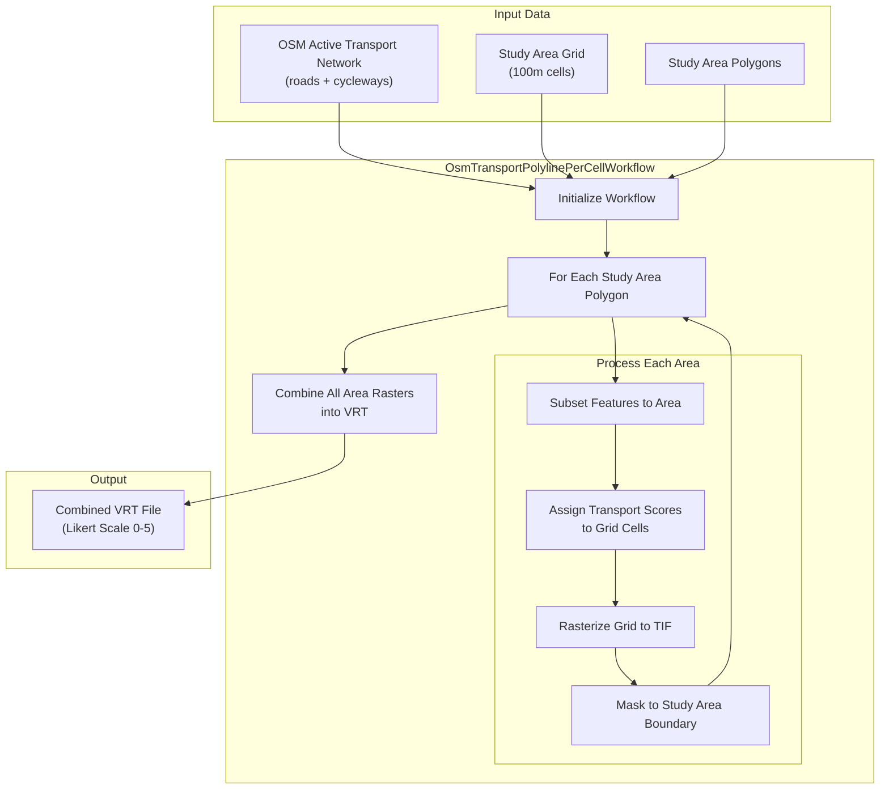
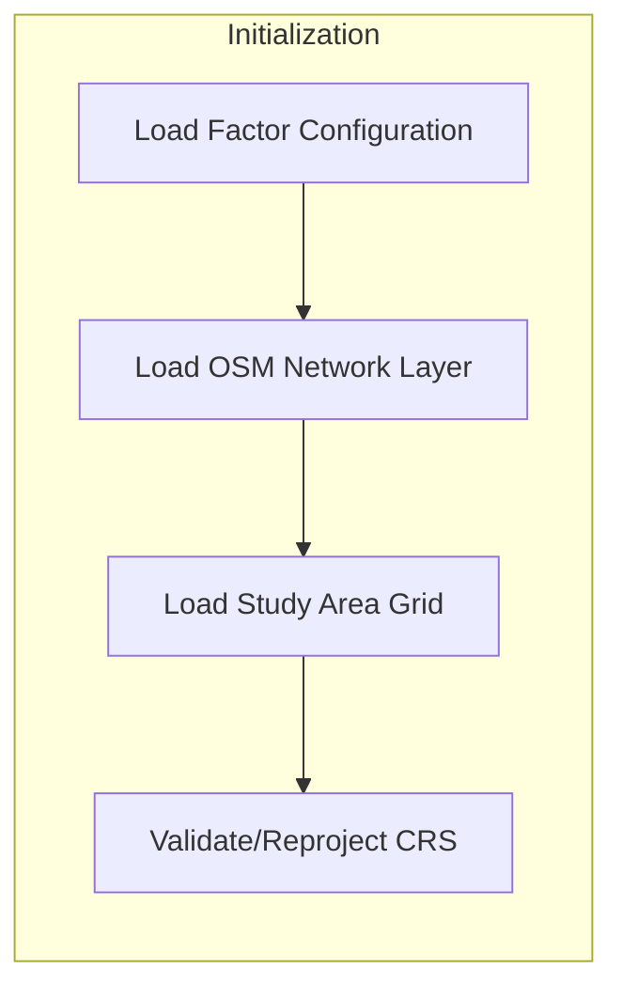
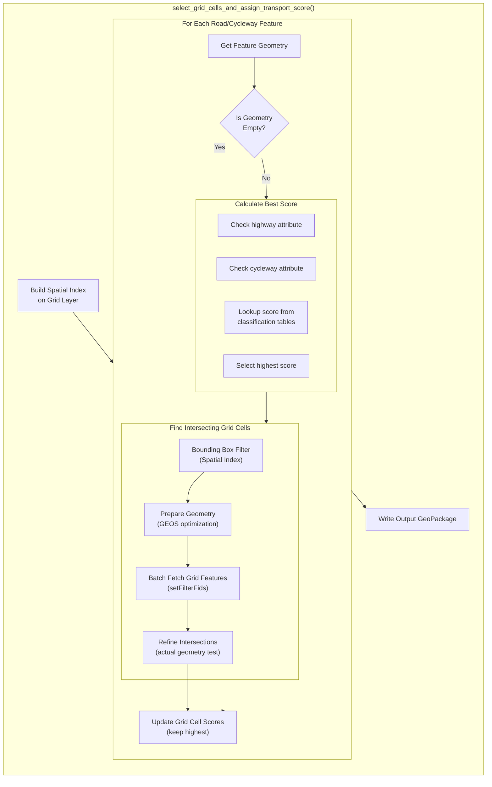
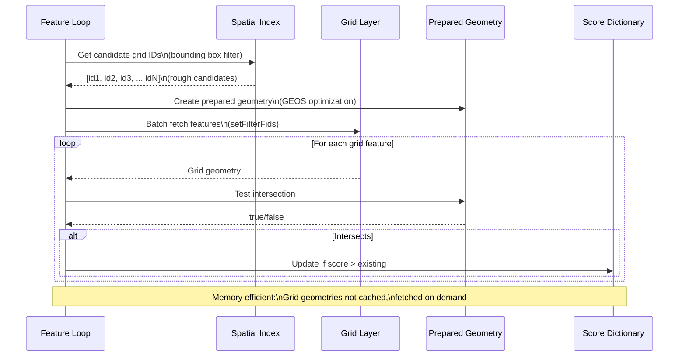
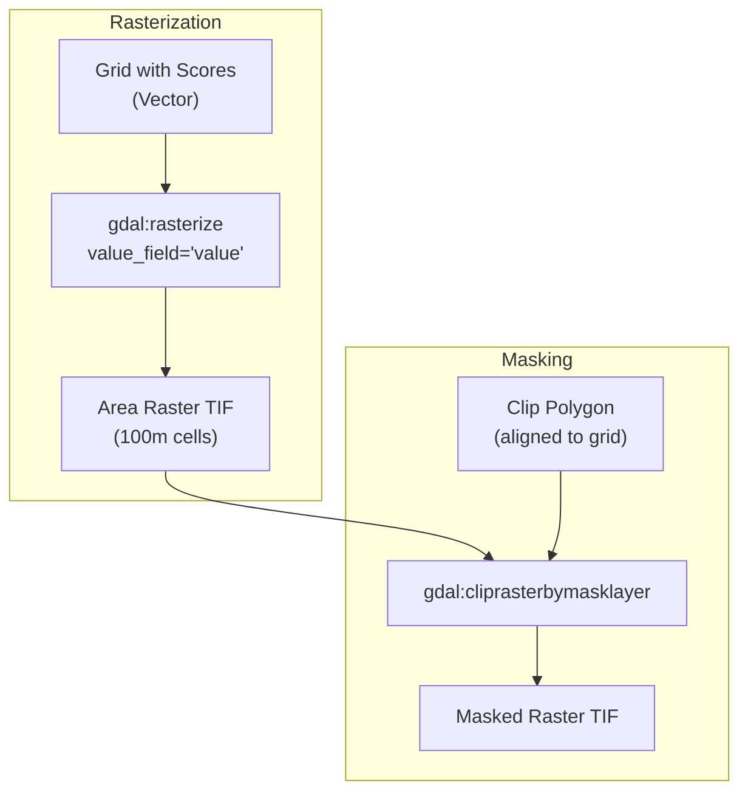
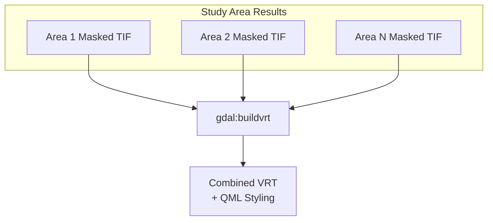

# Active Transport Analysis Workflow

## Overview

The Active Transport analysis evaluates walkability and cycling infrastructure by:

1. **Scoring road/cycleway types** based on pedestrian/cycling suitability (1-5 scale)
2. **Assigning scores to grid cells** based on intersecting road segments
3. **Rasterizing results** for spatial analysis

## High-Level Architecture



## Detailed Processing Steps

### Step 1: Workflow Initialization



The workflow begins by:

- Loading the factor configuration from the model JSON
- Loading the OSM active transport network (combined roads and cycleways)
- Loading the study area grid (typically 100m cells)
- Validating and reprojecting all layers to a common CRS

### Step 2: Features Per Cell Processing (Core Algorithm)

This is the core algorithm where road segments are scored and assigned to grid cells.



### Step 3: Road Classification Scoring

Roads and cycleways are scored based on their suitability for walking and cycling:

#### Highway Classification

| Score | Suitability | Road Types |
|-------|-------------|------------|
| 5 | Excellent | residential, living_street, pedestrian, footway, steps |
| 4 | Good | tertiary, tertiary_link, cycleway, path |
| 3 | Moderate | secondary, secondary_link, unclassified, road, service, bridleway |
| 2 | Poor | primary, primary_link, track |
| 1 | Very Poor | motorway, trunk, motorway_link, trunk_link |
| 0 | Unsuitable | bus_guideway, escape, raceway, construction, proposed |

#### Cycleway Classification (National Scale)

| Score | Cycleway Types |
|-------|---------------|
| 4 | lane, shared_lane, share_busway, track, separate, crossing, shoulder, link |

#### Cycleway Classification (Local Scale)

| Score | Cycleway Types |
|-------|---------------|
| 5 | lane, track, separate, crossing |
| 4 | shared_lane |
| 3 | link |
| 2 | share_busway, shoulder |

The algorithm checks **both** highway and cycleway attributes on each feature and assigns the **highest score** from either.

### Step 4: Memory-Efficient Intersection Algorithm

The intersection algorithm is optimized for large datasets:



**Key optimizations:**

1. **Spatial Index**: O(log n) bounding box queries instead of O(n) full scans
2. **Prepared Geometry**: GEOS pre-processes feature geometry for faster repeated intersection tests
3. **Batch Feature Request**: `setFilterFids()` fetches only candidate grid cells
4. **On-demand Loading**: Grid geometries are not cached, keeping memory usage low

### Step 5: Rasterization and Masking

After scoring, the grid is converted to a raster:



### Step 6: Final Combination

All area rasters are combined into a single VRT:



## Performance Optimizations

| Optimization | Description | Memory Impact |
|-------------|-------------|---------------|
| **Prepared Geometry** | GEOS pre-processes feature geometry for faster repeated intersection tests | Minimal |
| **Batch Feature Request** | `setFilterFids()` fetches only needed grid cells | Low (on-demand) |
| **Reduced Logging** | Log every ~5% instead of every feature | None |
| **Spatial Index** | `QgsSpatialIndex` for O(log n) bounding box queries | Moderate (required) |

## Data Flow Summary

```
OSM Network (lines with highway/cycleway attributes)
    |
    v
Spatial Index Query (bounding box filter)
    |
    v
Prepared Geometry Intersection (refined filter)
    |
    v
Score Assignment (highest wins per cell)
    |
    v
Grid GeoPackage (cells with 'value' field)
    |
    v
Rasterization (100m TIF)
    |
    v
Masking (clip to study area)
    |
    v
VRT Combination (all areas merged)
```

## Output Interpretation

| Score | Meaning | Example Road Types |
|-------|---------|-------------------|
| 5 | Excellent for walking/cycling | residential, pedestrian, footway |
| 4 | Good | tertiary, cycleway, path |
| 3 | Moderate | secondary, unclassified, service |
| 2 | Poor | primary, track |
| 1 | Very poor | motorway, trunk |
| 0 | Unsuitable/No data | bus_guideway, construction, or no roads |

## File Locations

- **Workflow Class**: `geest/core/workflows/osm_transport_polyline_per_cell_workflow.py`
- **Score Assignment**: `geest/core/algorithms/features_per_cell_processor.py`
- **Classification Tables**: `geest/core/workflows/mappings/active_transport.py`
- **Base Workflow**: `geest/core/workflows/workflow_base.py`
