# Table of Contents

- [SAFStreetLight Function](#safstreetLight-function)
    - [Substitute Streetlights Data Generation](#substitute-streetlights-data-generation)
- [SAFPerceivedSafety Function](#safperceivedSafety-function)
    - [Substitute Perceived Safety Data Generation](#substitute-perceived-safety-data-generation)

## Additional Resources

- [St. Lucia Administrative boundaries](https://data.humdata.org/dataset/cod-ab-lca?)

# SAFStreetLight Function

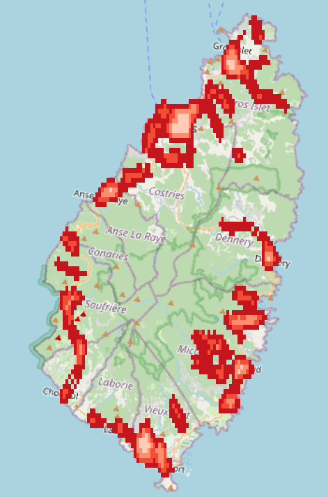

## Function Overview

The `SAFStreetLight` function processes streetlight vector data to create a raster representation of safety scores based on streetlight coverage.

## Key Components

### Constants
- `LIGHT_AREA_RADIUS`: 20 meters
- `SCORE_BINS`: [0, 1, 20, 40, 60, 80, 100]
- `SCORES`: [0, 0, 1, 2, 3, 4, 5]

### Main Steps
1. Setup: Initialize directories and paths
2. Input Processing: Load and reproject vector layer if necessary
3. Buffering: Create 20-meter buffers around streetlight points
4. Rasterization: Convert buffered vector to raster
5. Coverage Calculation: Use convolution for streetlight coverage
6. Score Assignment: Assign safety scores based on coverage percentage
7. Output: Save resulting raster and clean up

## Caller Relationship

Called by `SAFnightTimeLights` when input is a vector layer:

```python
def SAFnightTimeLights(self):
    # ... (earlier code)
    if input_layer.isValid():
        # Handle raster input
    else:
        # Handle vector input (assumed to be streetlights)
        self.SAFstreetLights()
```

## Technical Details

### Buffering
Uses QGIS processing tool "native:buffer" with parameters:
- Distance: 20 meters
- Segments: 8
- End cap style: 0
- Join style: 0
- Miter limit: 2
- Dissolve: False

### Rasterization
Uses GDAL rasterize with parameters:
- Burn value: 1
- No data value: 0

### Coverage Calculation
Employs a convolution operation:
1. Create circular kernel
2. Slide kernel over rasterized data
3. Calculate coverage percentage

### Score Assignment
Uses numpy operations:
1. Digitize coverage percentage into bins
2. Map bin indices to scores

## Substitute Streetlights Data Generation

Due to the unavailability of actual streetlight location data in the sample dataset and limited time for sourcing, a method was devised to generate substitute data based on available road network information.

### Data Source and Preprocessing

The primary data source was the roads shapefile for the area of interest. A subset of roads was extracted based on the following criteria:
1. 'Residential' roads from the 'highways' category
2. 'Tertiary', 'Secondary', and 'Primary' roads, which were merged into a single category of major roads

This extraction process provided a foundation for estimating streetlight distributions.

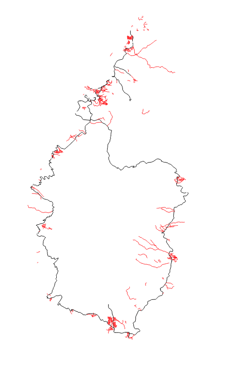

### Residential Streetlight Generation

For residential roads, points were scattered along the geometry at 50-meter intervals. This interval was chosen to approximate the typical spacing of streetlights in residential areas.

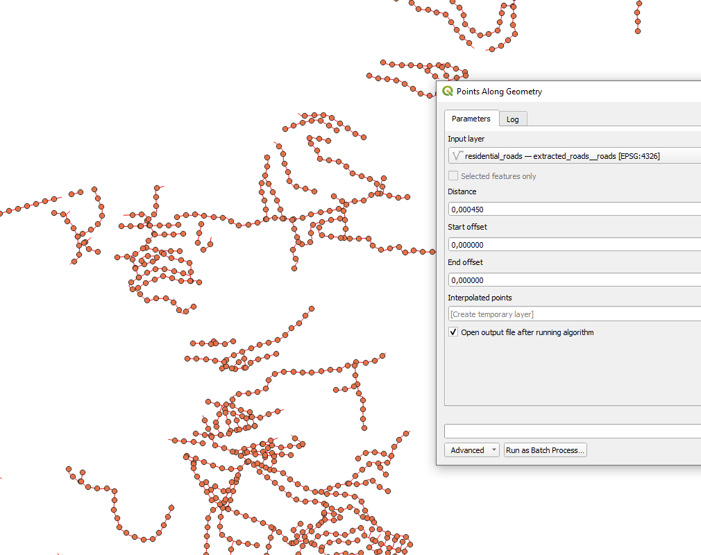

### Major Road Streetlight Generation

The process for major roads involved additional steps:
1. The merged major roads were filtered based on segment lengths to exclude longer cross-country roads that typically have less frequent lighting.
2. Points were then scattered along the remaining geometry at 150-meter intervals, reflecting the generally wider spacing of streetlights on major roads compared to residential areas.

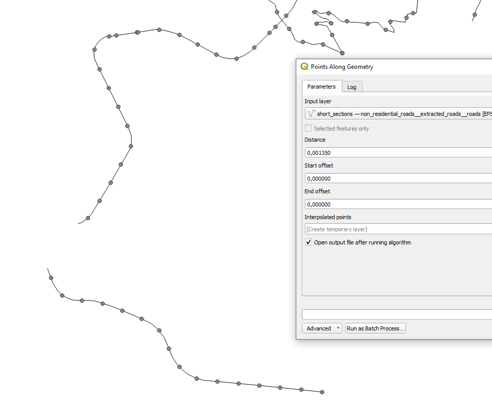

### Resulting Distribution

This methodology produces a calculated estimation of light source distribution for development purposes. The resulting point dataset approximates streetlight locations based on road type and typical lighting patterns.

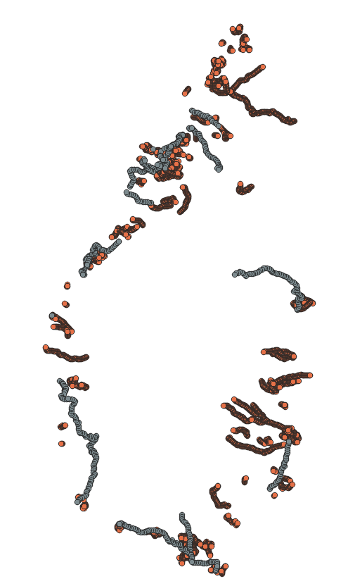

The final distribution provides a reasonable proxy for actual streetlight locations, allowing for the development and testing of the SAFStreetLight function in the absence of real-world data.

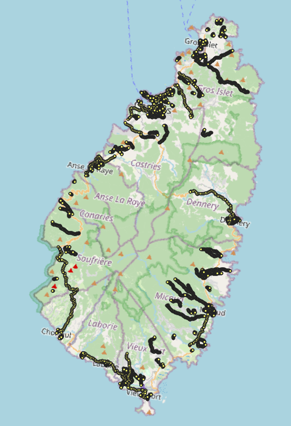

# SAFPerceivedSafety Function

bla bla

## Substitute 'Perceived Safety' Data Generation

Due to the unavailability of actual Perceived Safety data in the sample dataset, a method was devised to generate substitute data based on available building footprint information.

### Data Source and Preprocessing

The data sources used are the building_footprints and Adm2 shapefiles for the area of interest. The footprints accompany the example data and the Adm2 data was obtained from [HDX](https://data.humdata.org/dataset/cod-ab-lca?).


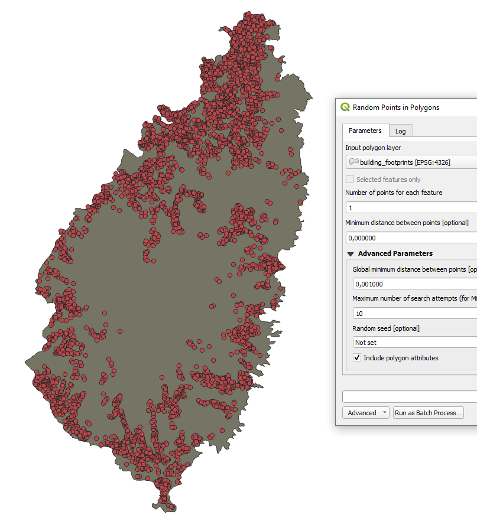

### ffdf

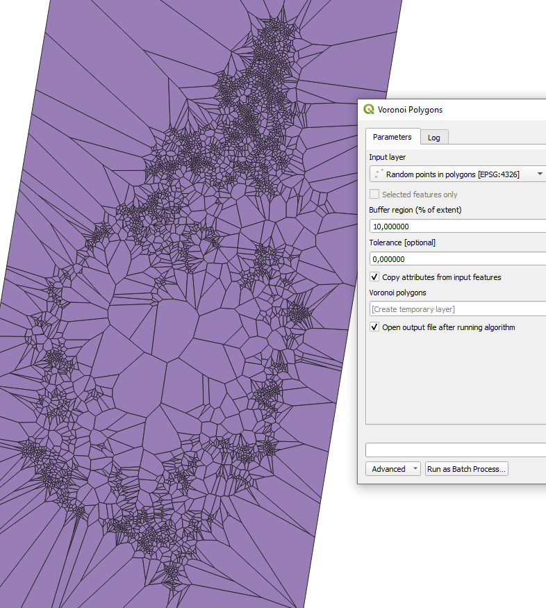

### ffdf

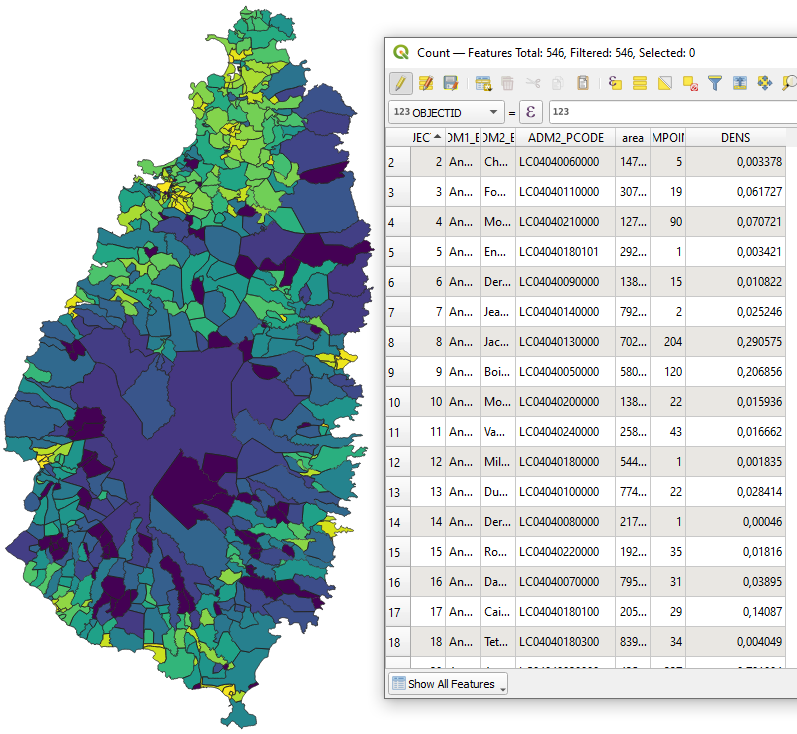

### sfsf

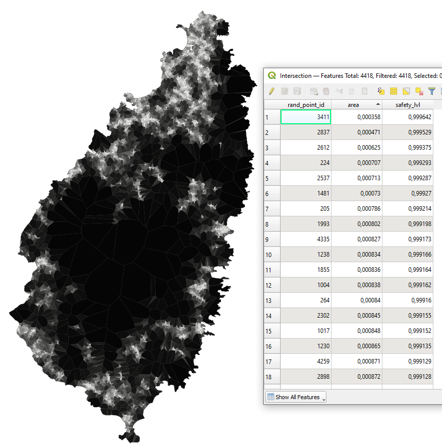

### Safety Level generation

The 'Artificial Perceived Safety' metric is introduced for development purposes to assign relative 'perceived' safety (from abuse/violence/crime) scores to regional areas based on nighttime lighting levels (x-axis) and population density (y-axis). The underlying assumption is that areas with fewer people and more night light are perceived to be safer, while areas with high population density and low light are perceived to be less safe. To model this, we assigned arbitrary relative values to the four corner cases: 

- low light/high population density was assigned a value of 0 (least safe), 
- low light/low population density was assigned a value of 1, 
- high light/high population density was assigned a value of 2
- high light/low population density was assigned a value of 3 (most safe) 

These assignments led to the derivation of the bilinear function: 

`k(x,y) = y(-(x(-a + b) + a - x(-c + d) + c)) + x(-a + b) + a`

rearranged to

`k(x,y) = xy(a - b - c + d) - xa + xb - ya - yc + a`

Substituting the values a = 1, b = 2, c = 0, and d = 3 into the equation, we obtain: 

`k(x,y) = xy(1 - 2 - 0 + 3) - x(1) + x(2) - y(1) - y(0) + 1`

Simplifying this, we get: 

`k(x,y) = xy(2) - x + 2x - y + 1`

which further simplifies to 

`k(x,y) = 2xy + x - y + 1`

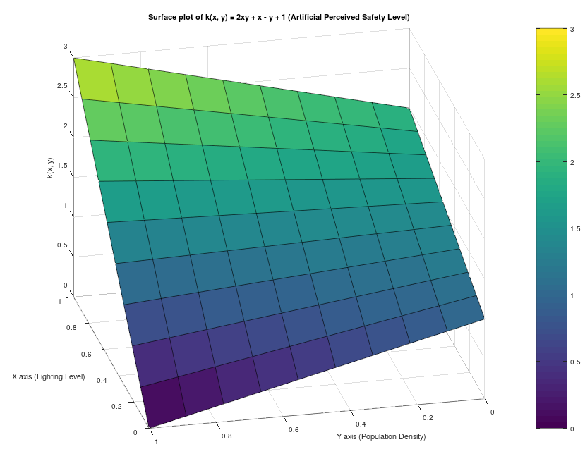

This bilinear function was chosen to reflect the interactions between these variables, capturing the increase in perceived safety with higher lighting and lower population density. The most unsafe conditions are characterized by low lighting and high population density, whereas the safest conditions are marked by high lighting and low population density. This function is then used to compute perceived safety scores for each region.
