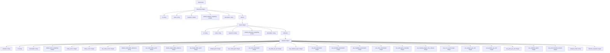

```mermaid
graph TB
    A[dimensions] --> B[Dimension Object]
    B --> B1[id: string]
    B --> B2[name: string]
    B --> B3[required: number]
    B --> B4[default_analysis_weighting: number]
    B --> B5[description: string]
    B --> B6[factors]
    B6 --> C[Factor Object]
    C --> C1[id: string]
    C --> C2[name: string]
    C --> C3[required: number]
    C --> C4[default_dimension_weighting: number]
    C --> C5[description: string]
    C --> C6[indicators]
    C6 --> D[Indicator Object]
    D --> D1[indicator: string]
    D --> D2[id: string]
    D --> D3[description: string]
    D --> D4[default_factor_weighting: number]
    D --> D5[index_score: integer]
    D --> D6[index_score: integer]
    D --> D7[use_index_score: integer]
    D --> D8[default_multi_buffer_distances: string]
    D --> D9[use_multi_buffer_point: integer]
    D --> D10[default_single_buffer_distance: integer]
    D --> D11[use_single_buffer_point: integer]
    D --> D12[default_pixel: integer]
    D --> D13[use_create_grid: integer]
    D --> D14[use_osm_downloader: integer]
    D --> D15[use_bbox_for_aoi: integer]
    D --> D16[use_rasterize_layer: integer]
    D --> D17[use_wbl_downloader: integer]
    D --> D18[use_humdata_downloader: integer]
    D --> D19[use_mapilliary_downloader: integer]
    D --> D20[use_other_downloader: integer]
    D --> D21[use_add_layers_manually: integer]
    D --> D22[use_classify_polygon_into_classes: integer]
    D --> D23[use_csv_to_point_layer: integer]
    D --> D24[use_polygon_per_cell: integer]
    D --> D25[use_polyline_per_cell: integer]
    D --> D26[use_point_per_cell: integer]
    D --> D27[use_nighttime_lights: integer]
    D --> D28[use_environmental_hazards: integer]
    D --> D29[analysis_mode: string]
    D --> D30[indicator_required: integer]

```