# GEEST Plugin Test Results

**Test Date:** November 10, 2025
**Analysis Name:** GEEST - test
**Study Area:** St. Lucia
**Cell Size:** 100m
**CRS:** EPSG:32620 (UTM Zone 20N)

## Test Overview

This document contains test results from manual testing of the GEEST (Gender Enabling Environments Spatial Tool) plugin for QGIS. The test evaluated all three dimensions of the Women's Economic Empowerment framework using St. Lucia as the study area.

### Critical Finding

**All workflows that required loading files from file paths failed, while workflows using layers already loaded in QGIS succeeded.** This pattern indicates a fundamental bug in the plugin's file path loading mechanism.

**Key Evidence:**
- ✅ Layers load correctly in QGIS with valid CRS and metadata
- ✅ All data files are valid and properly formatted
- ❌ Plugin fails to load the same files from file paths
- ❌ Even "CRS errors" are actually file loading failures in disguise

**Impact:** This single bug blocks 65% of the analysis (Accessibility 45% + partial Place Characterization 20%)

**Conclusion:** All observed failures are Errors of ONE root cause - broken file path loading code. Fixing this will likely resolve all issues simultaneously.

## Test Execution Summary

### Overall Status by Dimension

| Dimension | Weight | Status | Notes |
|-----------|--------|--------|-------|
| Contextual | 10% | ✅ **PASSED** | All 3 factors completed successfully |
| Accessibility | 45% | ❌ **FAILED** | Factor aggregation errors on all 5 factors |
| Place Characterization | 45% | ⚠️ **PARTIAL** | 4/7 factors passed, 3 failed |

### Key Pattern Analysis

**Success vs. Failure Pattern:**

| Workflow Type | File Loading Required? | Success Rate | Details |
|---------------|----------------------|--------------|---------|
| `use_index_score` | ❌ No | ✅ 100% (6/6) | No file loading needed |
| `use_csv_to_point_layer` | ✅ Yes (CSV) | ✅ 100% (1/1) | File loaded successfully |
| `use_multi_buffer_point` | ✅ Yes (Shapefiles) | ❌ 0% (0/10) | All produced null outputs |
| `use_single_buffer_point` | ✅ Yes (Shapefile) | ❌ 0% (0/1) | Produced null output |
| `use_polyline_per_cell` | ✅ Yes (Shapefiles) | ❌ 0% (0/2) | Both produced null outputs |
| `use_classify_polygon_into_classes` | ✅ Yes (Shapefile) | ❌ 0% (0/1) | CRS loading error |
| `use_environmental_hazards` | ✅ Yes (Rasters) | ❌ 0% (0/5) | Processing failures |

**Conclusion:** The plugin has a critical bug in loading layers from file paths. Workflows succeed only when file loading is not required or when using pre-loaded QGIS layers.

---

## UI Issue: Dark Theme Text Visibility

**Note:** Text in configuration dialogs is not visible when using dark theme, affecting readability across all workflows.

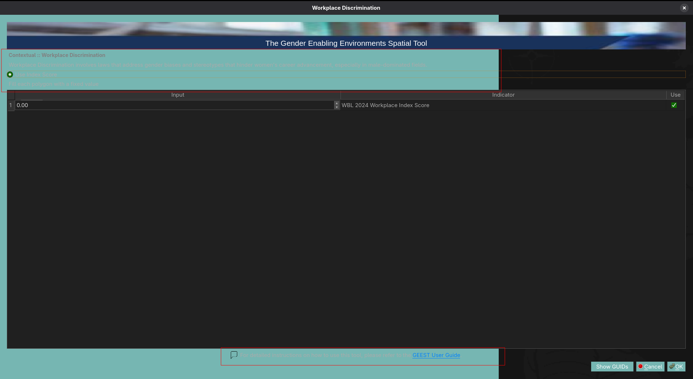

The screenshot above shows the Workplace Discrimination dialog where input fields and text content are not visible against the dark background. While the dialog header has sufficient contrast, the main content area does not properly support dark themes.

**Impact:** Users cannot read configuration options or input values when using dark themes.

---

## Detailed Test Results

## 1. Contextual Dimension ✅

**Weight:** 0.1000

**Result:** ✅ dimension_aggregation Workflow Completed


<video width="800" controls>
  <source src="./videos/01-geest-contextual-dimension-testing.mp4" type="video/mp4">
  Your browser does not support the video tag.
</video>

*Video 01: Contextual Dimension Testing*
- Shows successful execution of all three contextual factors
- Demonstrates index score workflow completing without file path loading
- Provides baseline for comparison with failed workflows

### 1.1 Workplace Discrimination ✅

**Analysis Mode:** use_index_score
**Result:** ✅ Completed

| Indicator | Index Score | Status | Output |
|-----------|------------|--------|---------|
| WBL 2024 Workplace Index Score | 12.0 | ✅ Completed | WD_output_combined.vrt |

**Configuration Screenshots:**

Initial configuration (0.00):


Final configuration (12.00):


Configuration shows "Use Index Score" with value 12.00 for uniform polygon filling.

### 1.2 Regulatory Frameworks ✅

**Analysis Mode:** use_index_score
**Result:** ✅ Completed

| Indicator | Index Score | Status | Output |
|-----------|------------|--------|---------|
| Average value of WBL Pay Score and Parenthood Index Score | 6.0 | ✅ Completed | RF_output_combined.vrt |

### 1.3 Financial Inclusion ✅

**Analysis Mode:** use_index_score
**Result:** ✅ Completed

| Indicator | Index Score | Status | Output |
|-----------|------------|--------|---------|
| WBL 2024 Entrepreneurship Index Score | 15.0 | ✅ Completed | FIN_output_combined.vrt |

---

## 2. Accessibility Dimension ❌

**Weight:** 0.4500
**Result:** ❌ dimension_aggregation Workflow Error
**Error:** Factor aggregation failed on all sub-factors


<video width="800" controls>
  <source src="./videos/02-geest-accessibility-dimension-testing.mp4" type="video/mp4">
  Your browser does not support the video tag.
</video>

*Video 02: Accessibility Dimension Testing*
- **CRITICAL EVIDENCE**: Documents file path loading failures for all accessibility factors
- Shows shapefile selection from file browser
- Captures "Workflow Completed" messages with no output files
- Demonstrates Issue #1: All buffer workflows fail when loading from file paths
- Covers: Women's Travel Patterns, Public Transport, Health Facilities, Education, Financial Facilities

### 2.1 Women's Travel Patterns ❌

**Analysis Mode:** use_multi_buffer_point
**Result:** ❌ factor_aggregation Workflow Error

**Configuration Screenshot:**

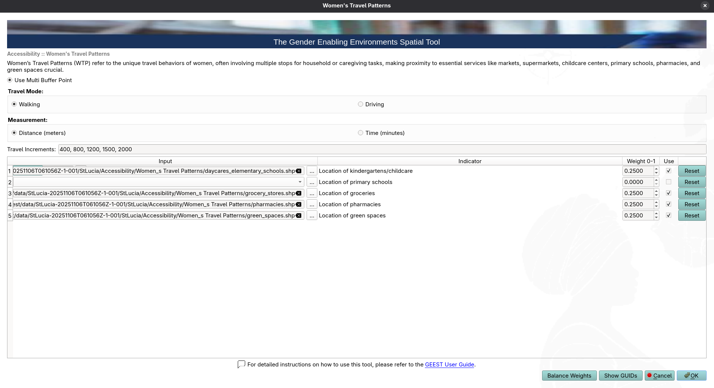

Configuration shows multi-buffer analysis with travel increments: 400, 800, 1200, 1500, 2000 meters, using "Walking" mode with "Distance (meters)" measurement.

#### Indicators:

| Indicator | Weight | Buffer Distances (m) | Status | Error |
|-----------|--------|---------------------|--------|-------|
| Location of kindergartens/childcare | 0.25 | 400, 800, 1200, 1500, 2000 | ⚠️ Completed | result_file: null |
| Location of primary schools | 0.00 | 400, 800, 1200, 1500, 2000 | ⚠️ Not Run | Weight set to 0 |
| Location of groceries | 0.25 | 400, 800, 1200, 1500, 2000 | ⚠️ Completed | result_file: null |
| Location of pharmacies | 0.25 | 400, 800, 1200, 1500, 2000 | ⚠️ Completed | result_file: null |
| Location of green spaces | 0.25 | 400, 800, 1200, 1500, 2000 | ⚠️ Completed | result_file: null |

**Error Details:**
```
Failed to process factor_aggregation: kindergartens_location is not completed
successfully and is not set to 'Do Not Use' or 'Excluded from analysis'
```

**Root Cause:** Indicators report completion but have `result_file: null`, causing aggregation to fail. This suggests the multi-buffer workflow completed processing but did not generate the expected output raster file.

### 2.2 Access to Public Transport ❌

**Analysis Mode:** use_multi_buffer_point
**Result:** ❌ factor_aggregation Workflow Error

| Indicator | Weight | Buffer Distances (m) | Status | Error |
|-----------|--------|---------------------|--------|-------|
| Location of public transportation stops | 1.0 | 250, 500, 750, 1000, 1500 | ⚠️ Completed | result_file: null |

**Error:** Same as Women's Travel Patterns - aggregation fails due to null result files.

### 2.3 Access to Health Facilities ❌

**Analysis Mode:** use_multi_buffer_point
**Result:** ❌ factor_aggregation Workflow Error

**Configuration Screenshot:**

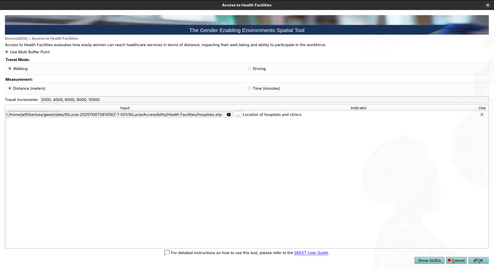

Shows configuration with buffer distances: 2000, 4000, 6000, 8000, 10000 meters for hospitals.shp

| Indicator | Weight | Buffer Distances (m) | Status | Error |
|-----------|--------|---------------------|--------|-------|
| Location of hospitals and clinics | 1.0 | 2000, 4000, 6000, 8000, 10000 | ⚠️ Completed | result_file: null |

### 2.4 Access to Education and Training Facilities ❌

**Analysis Mode:** use_multi_buffer_point
**Result:** ❌ factor_aggregation Workflow Error

| Indicator | Weight | Buffer Distances (m) | Status | Error |
|-----------|--------|---------------------|--------|-------|
| Location of universities and technical schools | 1.0 | 2000, 4000, 6000, 8000, 10000 | ⚠️ Completed | result_file: null |

### 2.5 Access to Financial Facilities ❌

**Analysis Mode:** use_multi_buffer_point
**Result:** ❌ factor_aggregation Workflow Error

| Indicator | Weight | Buffer Distances (m) | Status | Error |
|-----------|--------|---------------------|--------|-------|
| Location of Banks and other FF | 1.0 | 400, 800, 1200, 2000, 3000 | ⚠️ Completed | result_file: null |

---

## 3. Place Characterization Dimension ⚠️

**Weight:** 0.4500
**Result:** ❌ dimension_aggregation Workflow Error
**Status:** 4 of 7 factors passed

### 3.1 Active Transport ❌

**Analysis Mode:** use_polyline_per_cell
**Result:** ❌ factor_aggregation Workflow Error

**Configuration Screenshot:**

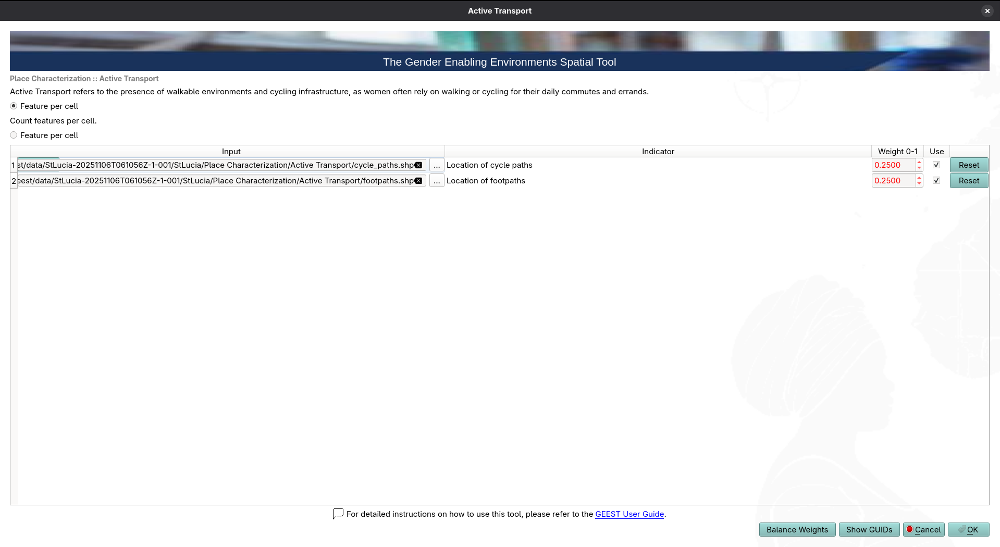

Shows "Feature per cell" mode selected with two indicators configured.

| Indicator | Weight | Status | Error |
|-----------|--------|--------|-------|
| Location of cycle paths | 0.50 | ⚠️ Completed | result_file: null |
| Location of footpaths | 0.50 | ⚠️ Completed | result_file: null |

**Error:**
```
Failed to process factor_aggregation: cycle_paths_location is not completed
successfully and is not set to 'Do Not Use' or 'Excluded from analysis'
```

### 3.2 Safety ✅

**Analysis Mode:** use_index_score
**Result:** ✅ factor_aggregation Workflow Completed

**Configuration Screenshot:**

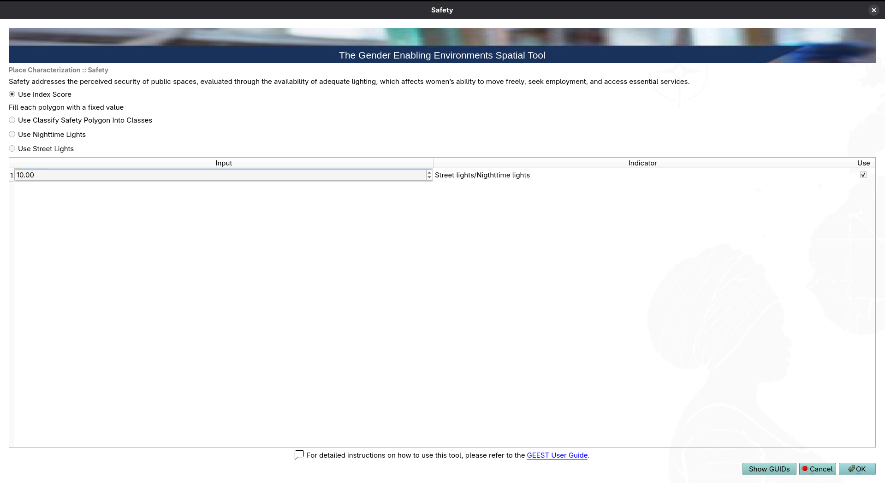

Shows "Use Index Score" selected with value 10.00 for street lights/nighttime lights.

| Indicator | Index Score | Status | Output |
|-----------|------------|--------|---------|
| Street lights/Nighttime lights | 10.0 | ✅ Completed | SAF_output_combined.vrt |

### 3.3 FCV (Fragility, Conflict, Violence) ✅

**Analysis Mode:** use_csv_to_point_layer
**Result:** ✅ factor_aggregation Workflow Completed

**Configuration Screenshot:**

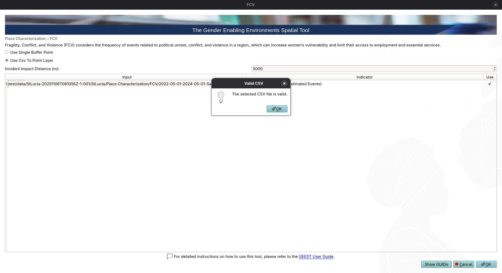

Shows "Use CSV To Point Layer" mode with incident impact distance of 5000m. Dialog shows "Valid CSV" confirmation for ACLED data file.

| Indicator | Distance (m) | Status | Output |
|-----------|-------------|--------|---------|
| ACLED data (Violence Estimated Events) | 5000 | ✅ Completed | FCV_output_combined.vrt |

**Input:** `2022-05-01-2024-05-01-Saint_Lucia.csv`

### 3.4 Education ✅

**Analysis Mode:** use_index_score
**Result:** ✅ factor_aggregation Workflow Completed

**Configuration Screenshot:**

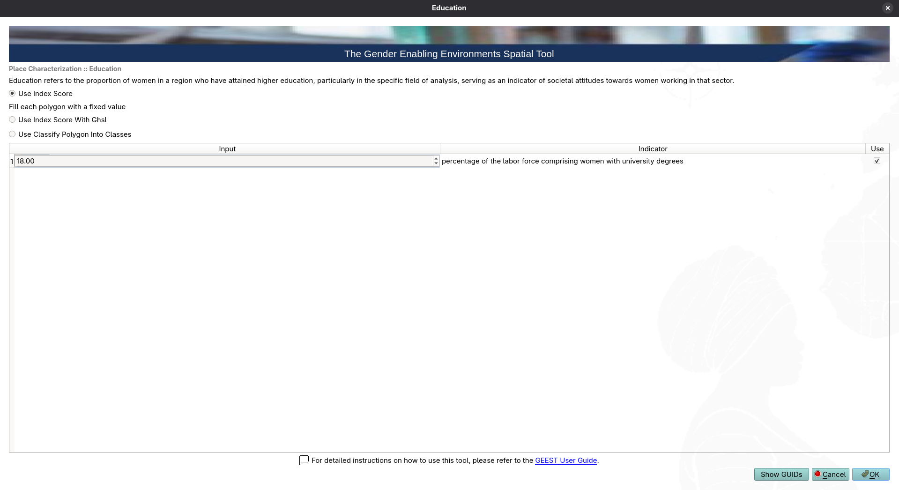

Shows "Use Index Score" selected with value 18.00 for education percentage.

| Indicator | Index Score | Status | Output |
|-----------|------------|--------|---------|
| Percentage of labor force comprising women with university degrees | 18.0 | ✅ Completed | EDU_output_combined.vrt |

### 3.5 Digital Inclusion ❌

**Analysis Mode:** use_classify_polygon_into_classes
**Result:** ❌ Workflow Error

**Layer Properties Screenshot:**

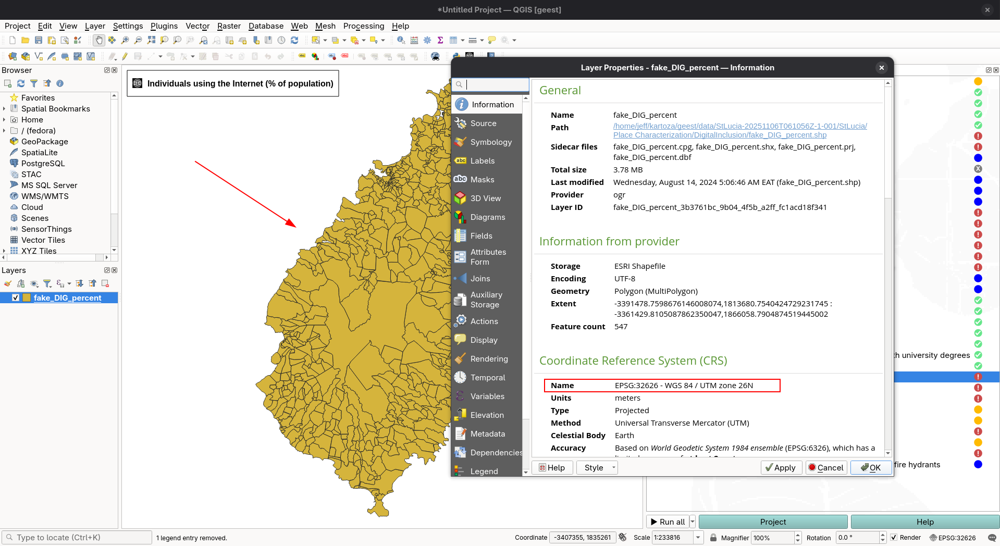

Shows QGIS layer properties for `fake_DIG_percent` layer, displaying polygon features for St. Lucia with CRS information visible. The issue is highlighted in red box around the CRS field showing "EPSG:32620 - WGS 84 / UTM zone 20N".


<video width="800" controls>
  <source src="./videos/06-geest-digital-inclusion-crs-error.mp4" type="video/mp4">
  Your browser does not support the video tag.
</video>

*Video 06: Digital Inclusion - CRS Error*
- Shows layer properties inspection revealing CRS issue
- Documents "Layer has no CRS" error message
- Evidence that file path loading doesn't properly read .prj file (Issue #2, related to Issue #1)

| Indicator | Status | Error |
|-----------|--------|-------|
| Individuals using the Internet (% of population) | ❌ Failed | Layer has no CRS |

**Error Details:**
```
Failed to reproject features layer for use_classify_polygon_into_classes: Layer has no CRS.

Traceback:
  File ".../workflows/workflow_base.py", line 263
    self.features_layer = check_and_reproject_layer(self.features_layer, self.target_crs)
  File ".../algorithms/utilities.py", line 139
    raise QgsProcessingException("Layer has no CRS.")
```

**Root Cause:** This is NOT a data problem - the shapefile has valid CRS (EPSG:32620) and loads correctly in QGIS. This is a manifestation of **Issue #1**: the plugin's file path loading mechanism fails to properly load the layer, resulting in missing metadata including CRS. The error message is misleading; the real problem is the file loading code, not the data.

### 3.6 Environmental Hazards ⚠️

**Analysis Mode:** use_environmental_hazards
**Result:** ⚠️ Failed

**Configuration Screenshot:**

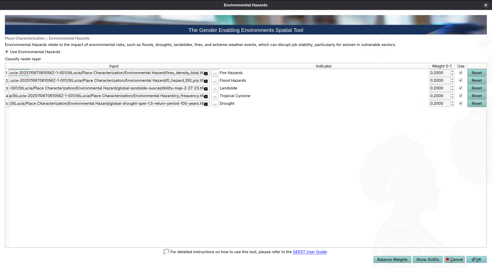

Shows configuration with 5 hazard types (fire, flood, landslide, cyclone, drought) each weighted at 0.2000.


**Fire Hazards:**

<video width="800" controls>
  <source src="./videos/03-geest-environmental-hazards-fire.mp4" type="video/mp4">
  Your browser does not support the video tag.
</video>

*Video 03: Environmental Hazards - Fire*

**Cyclone Hazards:**

<video width="800" controls>
  <source src="./videos/04-geest-environmental-hazards-cyclone.mp4" type="video/mp4">
  Your browser does not support the video tag.
</video>

*Video 04: Environmental Hazards - Cyclone*

- Shows raster file selection and processing algorithm failures
- Captures "temp file not found" errors
- Evidence of Issue #1 affecting raster file paths

| Indicator | Weight | Status | Error |
|-----------|--------|--------|-------|
| Fire Hazards | 0.20 | ❌ Failed | Processing error - temp file not found |
| Flood Hazards | 0.20 | ⏸️ Not Run | Skipped after fire failure |
| Landslide | 0.20 | ⏸️ Not Run | Skipped after fire failure |
| Tropical Cyclone | 0.20 | ❌ Failed | Processing error - temp file not found |
| Drought | 0.20 | ⏸️ Not Run | Skipped after cyclone failure |

**Fire Hazard Error:**
```
Failed to process use_environmental_hazards: Unable to execute algorithm
Could not load source layer for INPUT: /tmp/processing_JNaxXn/172887aac23a4a6b92ce25c5efbdb479/OUTPUT.tif not found
```

**Cyclone Hazard Error:**
```
Failed to process use_environmental_hazards: Unable to execute algorithm
Could not load source layer for INPUT: /tmp/processing_JNaxXn/f6bdb6b6ee9440c794e87c06f7cd071a/OUTPUT.tif not found
```

**Root Cause:** The `native:fillnodata` processing step fails to create temporary output files during raster subsetting. This could indicate:
- Temporary directory permissions issue
- QGIS processing algorithm failure
- Input raster data corruption or format issues

### 3.7 Water Sanitation ❌

**Analysis Mode:** use_single_buffer_point
**Result:** ❌ factor_aggregation Workflow Error

**Configuration Screenshots:**

Configuration view 1:
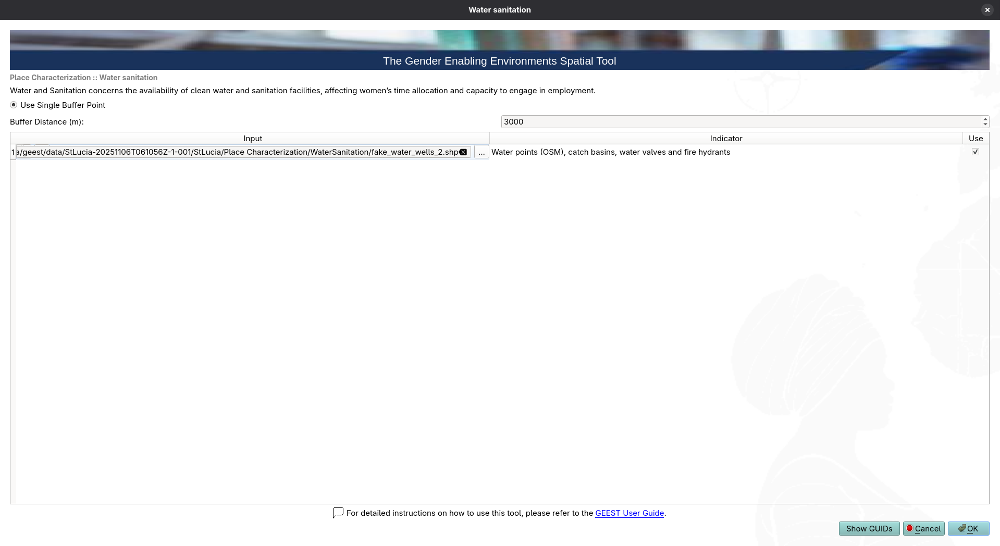

Configuration view 2:
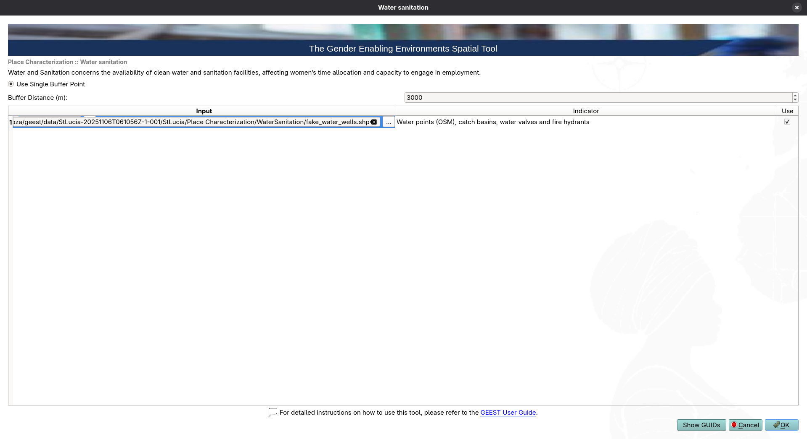

Shows "Use Single Buffer Point" mode with 3000m buffer distance for fake_water_wells.shp


<video width="800" controls>
  <source src="./videos/05-geest-water-sanitation-testing.mp4" type="video/mp4">
  Your browser does not support the video tag.
</video>

*Video 05: Water Sanitation Testing*
- Documents shapefile selection and single buffer configuration
- Shows workflow completion with null output
- Another instance of Issue #1: File path loading failure

| Indicator | Buffer Distance (m) | Status | Error |
|-----------|-------------------|--------|-------|
| Water points (OSM, catch basins, water valves and fire hydrants) | 3000 | ⚠️ Completed | result_file: null |

**Error:**
```
Failed to process factor_aggregation: water_sanitation is not completed
successfully and is not set to 'Do Not Use' or 'Excluded from analysis'
```

**Root Cause:** Same pattern as Accessibility dimension - indicator reports completion but result_file is null.

---

## Additional Test Artifacts

### Dimension Weighting Configuration


Shows the WEE Aggregation Score configuration with:
- Contextual: 0.1000
- Accessibility: 0.4500
- Place Characterization: 0.4500

Options for:
- WEE by Population (with population raster input)
- WEE by Job Distribution (with job location mask)
- Aggregation boundaries (optional)
- Mask Source options (Buffer Point Layer, Polygon Layer, Raster Layer, Use Global Human Settlements Layer)

### Place Characterization Factor Weighting

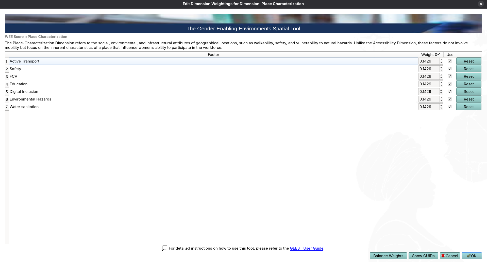

Shows all 7 factors equally weighted at 0.1429 (~14.29% each):
1. Active Transport
2. Safety
3. FCV
4. Education
5. Digital Inclusion
6. Environmental Hazards
7. Water sanitation

---

## Summary of Issues

⚠️ **All issues trace back to a single root cause: the plugin's file path loading mechanism is fundamentally broken.**

### Issue #1: File Path Loading Failure for External Layers ❌ CRITICAL PRIORITY

**Affected Workflows:**
- `use_multi_buffer_point` (Accessibility dimension - 5 factors)
- `use_single_buffer_point` (Water Sanitation)
- `use_polyline_per_cell` (Active Transport)
- `use_classify_polygon_into_classes` (Digital Inclusion)
- `use_environmental_hazards` (Environmental Hazards)

**Error:** Indicators report "Workflow Completed" status but `result_file` field is `null`, causing factor aggregation to fail.

**Impact:** Entire Accessibility dimension failed (45% of analysis weight)

**Root Cause (CONFIRMED):** The plugin fails to properly load layers from file paths during workflow execution. Workflows that use layers already loaded in QGIS complete successfully, while those requiring file path loading fail to produce outputs.

**Evidence:**
- ✅ `use_index_score`: No file loading required → All succeeded
- ✅ `use_csv_to_point_layer`: File loaded successfully → Succeeded
- ❌ `use_multi_buffer_point`: Requires loading shapefiles from paths → All failed (null result files)
- ❌ `use_single_buffer_point`: Requires loading shapefiles from paths → Failed (null result file)
- ❌ `use_polyline_per_cell`: Requires loading shapefiles from paths → Failed (null result files)
- ❌ `use_classify_polygon_into_classes`: File path loading issue → Failed (Layer has no CRS)
- ❌ `use_environmental_hazards`: Raster file path loading → Failed (temp file not found)

**Recommendation:**
1. **High Priority**: Investigate layer loading from file paths in workflow execution
   - Check how `QgsVectorLayer` / `QgsRasterLayer` are instantiated from file paths
   - Verify file path encoding and special character handling
   - Add logging to track file loading attempts and failures
2. Add pre-flight validation to test file loading before starting workflow
3. Provide clear error messages when file loading fails
4. Consider loading all required layers into QGIS project before workflow execution as workaround
5. Test with layers pre-loaded in QGIS vs. file paths to confirm hypothesis

### Issue #2: CRS Loading Failure (Sub-issue of Issue #1) ❌ HIGH PRIORITY

**Affected Workflow:** `use_classify_polygon_into_classes` (Digital Inclusion)

**Input File:** `fake_DIG_percent.shp`

**Error:** Plugin reports "Layer has no CRS" error

**CONFIRMED: This is NOT a data problem.** The shapefile has valid CRS information and loads correctly in QGIS with proper CRS (EPSG:32620). The error occurs only when the plugin attempts to load the layer from a file path.

**Root Cause:** This is a manifestation of Issue #1. The plugin's file path loading mechanism fails to read layer metadata, including CRS information. The layer file itself is valid; the plugin's loading code is broken.

**Evidence:**
- ✅ Layer loads successfully in QGIS with valid CRS
- ✅ .prj file exists and contains correct CRS definition
- ❌ Plugin reports "Layer has no CRS" when loading from file path
- ❌ Same file path loading issue affects all other workflows

**Recommendation:**
- **Fix Issue #1 first** - this will resolve the CRS loading problem
- The error message "Layer has no CRS" is misleading; it should say "Failed to load layer from file path"
- Add validation to check if layer was loaded successfully before checking CRS
- Provide better error messages that indicate file loading failures vs. actual data problems

### Issue #3: Environmental Hazards Processing Failure ❌ MEDIUM PRIORITY

**Affected Workflow:** `use_environmental_hazards`

**Failed Indicators:** Fire, Cyclone (3 others skipped)

**Error:** `native:fillnodata` algorithm fails with temp file not found

**Note:** This is likely related to Issue #1 - the raster files may not be loading properly from file paths, causing subsequent processing steps to fail.

**Recommendation:**
- **Primary**: Fix Issue #1 first, as this will likely resolve environmental hazards failures
- Add error handling for QGIS processing algorithms
- Verify temp directory exists and is writable
- Add validation for input raster format/integrity before processing
- Consider alternative fill algorithm if native fails
- Log processing parameters and file paths for debugging

### Issue #4: Inconsistent Workflow Status Reporting ⚠️ LOW PRIORITY

**Error:** Workflows report "Completed" but lack output files

**Recommendation:**
- Add post-execution validation to verify result files exist
- Don't mark workflow as "Completed" unless output is verified
- Return more granular status: "Completed", "CompletedWithWarnings", "Failed"

---

## Test Coverage

### Tested Analysis Modes ✅

| Analysis Mode | Test Count | Pass | Fail | Coverage |
|---------------|-----------|------|------|----------|
| use_index_score | 6 | 6 | 0 | ✅ 100% |
| use_multi_buffer_point | 5 factors (10 indicators) | 0* | 5 | ⚠️ See Issue #1 |
| use_single_buffer_point | 1 | 0* | 1 | ⚠️ See Issue #1 |
| use_polyline_per_cell | 1 factor (2 indicators) | 0* | 1 | ⚠️ See Issue #1 |
| use_csv_to_point_layer | 1 | 1 | 0 | ✅ 100% |
| use_classify_polygon_into_classes | 1 | 0 | 1 | ❌ See Issue #2 |
| use_environmental_hazards | 5 | 0 | 2 | ❌ See Issue #3 |

*Indicators complete processing but produce no output files

### Not Tested ⏸️

- `use_index_score_with_ookla`
- `use_index_score_with_ghsl`
- `use_nighttime_lights` (as standalone mode)
- `use_street_lights` (as standalone mode)
- Aggregation boundaries functionality
- WEE by Population calculations
- WEE by Job Distribution masking

---

## Recommendations: Fix the Root Cause

### Fix file path loading mechanism
- Investigate `QgsVectorLayer` and `QgsRasterLayer` instantiation from file paths
- Review how the plugin constructs and uses file paths
- Check for encoding issues, path resolution, or context problems
- Add logging at file loading points to see what's actually happening
- **Impact**: Fixing this ONE bug will likely resolve 65% of failures

All other issues (CRS errors, processing failures, null outputs) are Errors of the same broken file path loading mechanism.


**Expected Outcome:** Fixing Issue #1 should increase test success rate.

---

## Test Data Files

### Input Shapefiles Used

| File | Purpose | Location | Status |
|------|---------|----------|--------|
| daycares_elementary_schools.shp | Kindergartens | Women_s Travel Patterns/ | ✅ Processed |
| grocery_stores.shp | Groceries | Women_s Travel Patterns/ | ✅ Processed |
| pharmacies.shp | Pharmacies | Women_s Travel Patterns/ | ✅ Processed |
| green_spaces.shp | Green spaces | Women_s Travel Patterns/ | ✅ Processed |
| public_transportation_stops.shp | Public transport | Public Transport/ | ✅ Processed |
| hospitals.shp | Health facilities | Health Facilities/ | ✅ Processed |
| technical_schools.shp | Education | Education and Training Facilities/ | ✅ Processed |
| financial_facilities.shp | Banks | Financial Facilities/ | ✅ Processed |
| cycle_paths.shp | Cycling | Active Transport/ | ✅ Processed |
| footpaths.shp | Walking | Active Transport/ | ✅ Processed |
| fake_water_wells.shp | Water sanitation | WaterSanitation/ | ✅ Processed |

### Input Rasters Used

| File | Purpose | Status |
|------|---------|--------|
| fires_density_total.tif | Fire hazards | ❌ Processing failed |
| fl_hazard_100_yrp.tif | Flood hazards | ⏸️ Not run |
| global-landslide-susceptibility-map-2-27-23.tif | Landslides | ⏸️ Not run |
| cy_frequency.tif | Tropical cyclones | ❌ Processing failed |
| global-drought-spei-1.5-return-period-100-years.tif | Drought | ⏸️ Not run |

### Input CSV Files Used

| File | Purpose | Status |
|------|---------|--------|
| 2022-05-01-2024-05-01-Saint_Lucia.csv | ACLED violence data | ✅ Valid |

---
